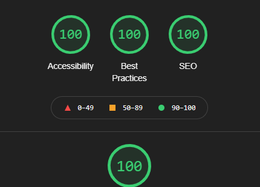
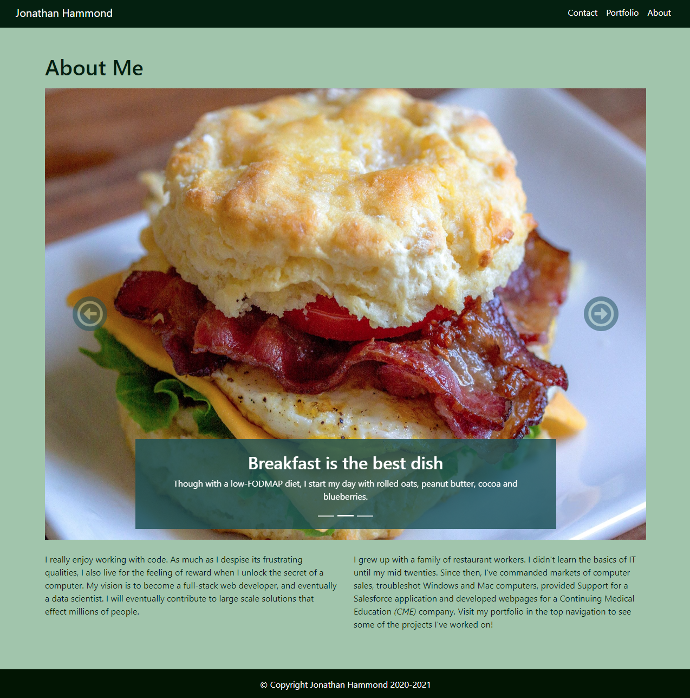
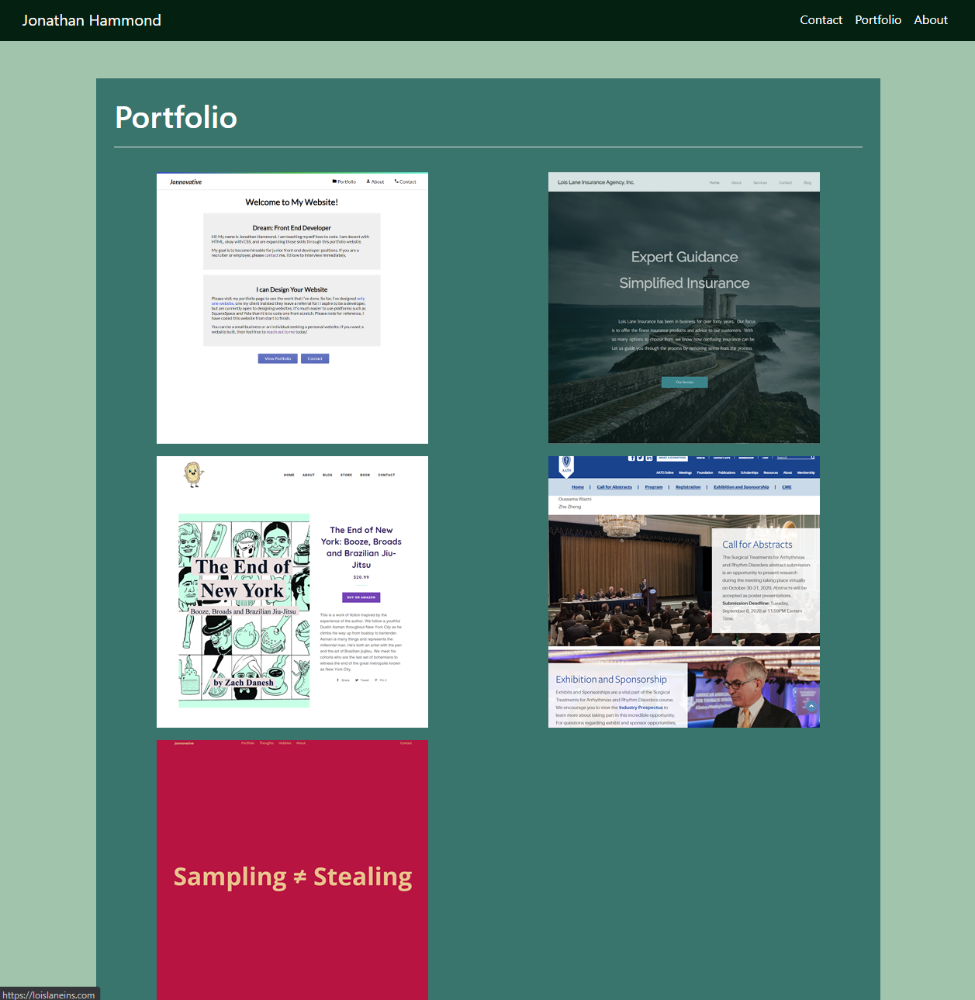
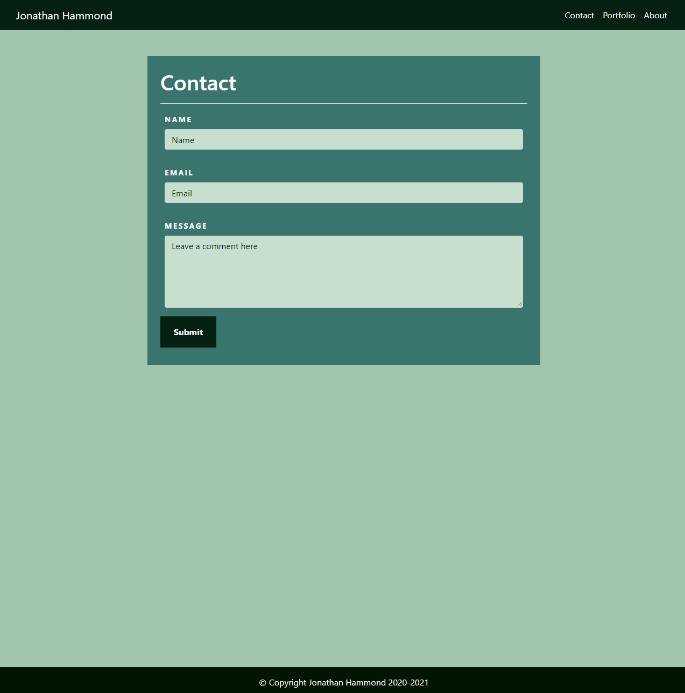

# ResposivePortfolio
*My Responsive Portfolio Website made with Bootstrap*

[View Deployed Application Here.](https://pythonidaer.github.io/ResposivePortfolio/)

## Installation
1. Clone repository to your local device
2. Folders are structured already, so test by opening the index.html file in your browser. If it looks good, it's working right.
3. If it does not work, right-click Inspect console to determine if there is an issue with the directories.

## Usage
This repo is simply a homework assignment. Feel free to inspect the code and notice how I made a 3-page responsive website using Bootstrap components:
- Navigation
- Carousel
- Sticky Footer
- Form
- Image Grid
  
## Credits
[Kevin Powell](https://www.youtube.com/watch?v=yc2olxLgKLk) taught me how to stick my footer to the bottom of the webpage regardless of document content!

[W3Validator](https://validator.w3.org/) helped me find an accessibility error in my contact `<form>`

[w3Schools](https://www.w3schools.com/tags/att_textarea_cols.asp) taught me how to add more rows to my `<textarea>`

[Google Lighthouse](https://developers.google.com/web/tools/lighthouse#devtools) provided the tools I needed to test my webpages for accessibility

[MDN Documents](https://developer.mozilla.org/en-US/docs/Web/Accessibility/ARIA/ARIA_Techniques/Using_the_aria-describedby_attribute) taught me how to utilzie the `aria-describedby` attribute!

[web.dev](https://web.dev/external-anchors-use-rel-noopener/?utm_source=lighthouse&utm_medium=devtools) provided explanation why I should add `rel="noreferrer"` for added security to my `<a>` with `target="_blank"`!

  
## License
I've chosen an MIT License. Do what you'd like with this material.

#### The Proof

#### The Website

